```mermaid
graph LR
    C1(📄 Audio File) --> C2((Buffer Source))
    C2 --> C3((🎚️ Gain Node))
    C3 --> C4{🔈 Output}

    style C1 fill:#1B1B1F,stroke:#FF00F7,color:#FF00F7
    style C2 fill:#1B1B1F,stroke:#ddd,color:#ddd
    style C3 fill:#1B1B1F,stroke:#ddd,color:#ddd
    style C4 fill:#1B1B1F,stroke:#00E8FF,color:#00E8FF
```

```mermaid
graph LR
    C1(📄 Audio File) --> C2((Buffer Source))
    C2 --> C3((🎚️ Gain Node))
    C3 --> C4{🔈 Output}

    %% LFO Chain for Tremolo
    T4(OscillatorNode<br/>🌊 LFO Sine Wave<br/><i>0.1-20 Hz</i>) --> T5(GainNode<br/>📈 LFO Depth Control<br/><i>0-100%</i>)
    T5 -.->|Modulates| C3

    style C1 fill:#1B1B1F,stroke:#FF00F7,color:#FF00F7
    style C2 fill:#1B1B1F,stroke:#ddd,color:#ddd
    style C3 fill:#1B1B1F,stroke:#ddd,color:#ddd
    style C4 fill:#1B1B1F,stroke:#00E8FF,color:#00E8FF
    style T4 fill:#1B1B1F,stroke:#A855F7,color:#A855F7
    style T5 fill:#1B1B1F,stroke:#A855F7,color:#A855F7
```

---
# You can also start simply with 'default'
theme: apple-basic # bricks
# random image from a curated Unsplash collection by Anthony
# like them? see https://unsplash.com/collections/94734566/slidev
# background: https://source.unsplash.com/collection/94734566/1920x1080
# some information about your slides (markdown enabled)
title: "Mozart Never Had React Native: You Do"
info: |
  ## Mozart Never Had React Native: You Do!
  Craft Unforgettable UXs with Sound
# apply unocss classes to the current slide
class: text-center
layout: center
# https://sli.dev/features/drawing
drawings:
  persist: false
# slide transition: https://sli.dev/guide/animations.html#slide-transitions
transition: slide-up
# enable MDC Syntax: https://sli.dev/features/mdc
mdc: true
# open graph
# seoMeta:
#  ogImage: https://cover.sli.dev
highlighter: shiki
lineNumbers: false
---

<style>
.main-title {
  position: absolute;
  top: 50%;
  left: 50%;
  transform: translate(-50%, -50%);
  width: 100%;
  padding: 2rem;
}

.main-title h1 {
  /* background: linear-gradient(to right, #00E8FF, #FF00F7);
  -webkit-background-clip: text;
  -webkit-text-fill-color: transparent; */
  color: #ddd;
  font-size: 3.5rem !important;
  line-height: 1.2 !important;
  margin-bottom: 1.5rem !important;
  padding: 0.5rem 0;
}

.main-title h2 {
  font-size: 2rem !important;
  line-height: 1.4 !important;
  opacity: 0.75;
  padding: 0.5rem 0;
}

.emoji {
  -webkit-background-clip: initial !important;
  -webkit-text-fill-color: initial !important;
  display: inline-block;
}

.bold-gradient {
  background: linear-gradient(to right, #00E8FF, #FF00F7);
  -webkit-background-clip: text;
  -webkit-text-fill-color: transparent;
  font-weight: bold;
}

.text-gradient {
  background: linear-gradient(to right, #00E8FF, #FF00F7);
  -webkit-background-clip: text;
  -webkit-text-fill-color: transparent;
}

.bold-blue {
  color: #00E8FF;
}

.slide-title, h1 {
  color: #ddd;
  /* color: #00E8FF; */
  font-size: 2.5rem !important;
  margin-bottom: 2rem !important;
}

.mermaid-diagram {
  border: 2px solid;
  border-image: linear-gradient(to right, #00E8FF, #FF00F7) 1;
  border-radius: 8px;
  padding: 1rem;
}

.code-block {
  border: 2px solid;
  border-image: linear-gradient(to right, #00E8FF, #FF00F7) 1;
  border-radius: 8px;
}

/* Styles pour le diagramme de Venn */
.border-gradient {
  border-image: linear-gradient(45deg, #00E8FF, #FF00F7) 1;
}

.border-\[\#00E8FF\] {
  box-shadow: 0 0 15px rgba(0, 232, 255, 0.2);
}

.border-\[\#FF00F7\] {
  box-shadow: 0 0 15px rgba(255, 0, 247, 0.2);
}

.bg-\[\#00E8FF10\] {
  background: rgba(0, 232, 255, 0.05);
}

.bg-\[\#FF00F710\] {
  background: rgba(255, 0, 247, 0.05);
}

/* Style pour les listes du diagramme de Venn */
.venn-list {
  list-style: none;
  padding: 0;
  margin: 0;
}

.venn-list li {
  display: flex;
  gap: 0.5rem;
}

.venn-list.text-right li {
  justify-content: flex-end;
}

/* Styles pour les points négatifs */
.negative-point {
  opacity: 0.6;
  font-style: italic;
  position: relative;
  padding-left: 1.5em;
}

.negative-point::before {
  content: "🚫";
  position: absolute;
  left: 0;
}
</style>

<div class="main-title">
  <h1>Mozart Never Had React Native.<br />
  <span class="bold-gradient">You DO!</span></h1>
  <h2>Craft Unforgettable UXs with Sound</h2>
</div>

<div class="abs-bl ml-4 mb-4 flex items-center gap-4">
  
  <div class="flex flex-col">
    <div class="text-xl font-bold">Kim Chouard</div>
    <div class="text-sm opacity-75">
      CTO @ <a href="https://odiseimusic.com" target="_blank" class="text-blue-500 hover:underline">Odisei Music</a>
    </div>
  </div>
</div>

<div class="abs-br mr-4 mb-4 flex items-center gap-4">
  <div class="flex flex-col items-end">
    <div class="text-xl">App.js 2025</div> <!-- Update with actual date if known -->
    <div class="text-sm opacity-75">@Kraków, Poland</div> <!-- Update with actual venue if known -->
  </div>
  
</div>

---
layout: center
class: text-center
transition: slide-up
---

# Guess the sound! 👂

<audio ref="microwaveAudioRef" src="/microwave-ding.wav" preload="auto"></audio>
<audio ref="netflixAudioRef" src="/netflix-intro.mp3" preload="auto"></audio>
<!-- <audio ref="duolingoAudioRef" src="/iphone-lock.wav" preload="auto"></audio> -->
<audio ref="duolingoAudioRef" src="/duolingo-success-ting.m4a" preload="auto"></audio>

<div class="grid grid-cols-3 gap-20 mt-12">
  <div @click="$refs.netflixAudioRef?.pause(); if($refs.netflixAudioRef) $refs.netflixAudioRef.currentTime = 0; $refs.duolingoAudioRef?.pause(); if($refs.duolingoAudioRef) $refs.duolingoAudioRef.currentTime = 0; if($refs.microwaveAudioRef) $refs.microwaveAudioRef.currentTime = 0; $refs.microwaveAudioRef?.play()" class="flex flex-col items-center cursor-pointer p-2 hover:bg-white hover:bg-opacity-10 rounded-md transition-colors">
    <div class="text-2xl font-bold mb-4">Sound 1</div>
    <div class="flex gap-4 mt-5 relative">
      
      
    </div>
  </div>
  <div @click="$refs.microwaveAudioRef?.pause(); if($refs.microwaveAudioRef) $refs.microwaveAudioRef.currentTime = 0; $refs.duolingoAudioRef?.pause(); if($refs.duolingoAudioRef) $refs.duolingoAudioRef.currentTime = 0; if($refs.netflixAudioRef) $refs.netflixAudioRef.currentTime = 0; $refs.netflixAudioRef?.play()" class="flex flex-col items-center cursor-pointer p-2 hover:bg-white hover:bg-opacity-10 rounded-md transition-colors">
    <div class="text-2xl font-bold mb-4">Sound 2</div>
    <div class="flex gap-4 mt-5 relative pointer-events-none select-none">
      
      
    </div>
  </div>
  <div @click="$refs.microwaveAudioRef?.pause(); if($refs.microwaveAudioRef) $refs.microwaveAudioRef.currentTime = 0; $refs.netflixAudioRef?.pause(); if($refs.netflixAudioRef) $refs.netflixAudioRef.currentTime = 0; if($refs.duolingoAudioRef) $refs.duolingoAudioRef.currentTime = 0; $refs.duolingoAudioRef?.play()" class="flex flex-col items-center cursor-pointer p-2 hover:bg-white hover:bg-opacity-10 rounded-md transition-colors">
    <div class="text-2xl font-bold mb-4">Sound 3</div>
    <div class="flex gap-4 mt-5 relative">
      
      
      
    </div>
  </div>
</div>

<!--
Speaker Notes:

* "Let's have some fun before we dive in. Listen to these sounds and try to guess what they are."
* Crowd participation.
* End with: "You knew these sounds instantly. Why? Because sound is memory, emotion, identity."
-->

---
layout: default
class: text-left
transition: slide-left
---

<audio ref="iphoneRingtoneAudioRef" src="/iphone-original-ringtone.mp3" preload="auto" />
<audio ref="iphoneClicksAudioRef" src="/fake-iphone-sounds.mp3" preload="auto" />


<h1 @click="$refs.iphoneClicksAudioRef.currentTime = 0; $refs.iphoneClicksAudioRef.pause(); $refs.iphoneRingtoneAudioRef?.play()">🔊 🧠 The Power of Sound</h1>

<div class="flex-col gap-y-20">
<div v-click class="text-lg">

<h2 @click="$refs.iphoneRingtoneAudioRef.currentTime = 0; $refs.iphoneRingtoneAudioRef.pause(); $refs.iphoneClicksAudioRef?.play()"><strong class="bold-gradient">1. Microinteractions & Instant Feedback</strong></h2>

<ul>
  <li>Tiny sounds confirm actions > *feel* the interface.</li>
  <li v-click="5">Habit formation > better daily retention with sound.</li>
</ul>

</div>

<div v-click="2" />
<div v-click="[3,4]" class="absolute top-0 left-0 right-0 bottom-0">
  
</div>

<div v-click="6" class="text-lg">

## <strong class="bold-gradient">2. Ambient Sounds</strong>
  - Scene setting: Calm meditation cues, game immersion.
</div>

<div v-click="7" class="text-lg">

## <strong class="bold-gradient">3. Ear-cons</strong>

Instant brand recall > gets you into the "mood"

</div>
</div>

<!--
Speaker Notes:

* Humans process **auditory feedback faster** than visual cues. Sound also connects on a **deeper emotional level**.
* You didn't *see* anything, but you *felt* the story. **That's the power of sound!**
*   Start with the core assertion: "We actually process sound faster than visuals. And it hits us on a more emotional level."
* > *(Sound FX only skit: iPhone default ringtone → message notification tone → send message swish -> a LOT of message received swishes)*
* "And... \[call sounds] sorry... "Chérie"? Shit, not the right time honey. (mimicate hanging up). \[text sound] Excuse me, my baby is at home and... \[send swish] my bad. \[multiple receive swiches] (face become shocked) oh shit.
* I was kidding, this was all fake. I'm not texting anybody.
*  You didn't *see* anything, but I bet you could *picture* the whole scenario, maybe even *feel* a bit of the stress or urgency. That's the raw power of sound in storytelling and UX."
*   Click to reveal the first set of bullet points.
*   "So, why does this matter for our apps?"
*   **Microinteractions**: "Think about those tiny sounds – a toggle click, a message swoosh. They make the interface feel tangible, responsive. Our brains get that confirmation quicker through sound. Error sounds: Often faster than visual popups."
*   **Sonic Branding**: "Then there's sonic branding. Netflix's 'ta-dum' – you hear it, you know what's coming. It's like a logo for your ears – an 'earcon'. Or the sound of your mac startup. It's part of the experience. Studies show custom sounds significantly boost brand recall and user trust compared to generic OS tones. It's a worthwhile investment."
*   **Emotional Engagement**: "And the big one: emotion. Duolingo's little 'ding' for a correct answer? That's a dopamine hit. It makes you want to keep going. They've seen a 30% increase in daily retention when sound cues are on. Sound can set a mood, create immersion in games, or gently guide a user through a meditation app."
*   "Sound is the UX glue. It provides feedback, conveys brand, and enriches interactions, often subconsciously. It can elevate an app from good to unforgettable."
-->

---
layout: center
class: text-center
transition: slide-left
---

<h1 class="text-center text-white">Sound is the <strong class="bold-gradient">GLUE</strong> of your UX Design</h1>

<div class="flex w-full justify-center">
  
</div>


---
layout: center
transition: slide-down
---

<audio ref="momentsAudioRef" src="/a-few-moments-later.mp3" preload="auto"></audio>

# React Native + Audio = ...

<div v-click>
  <h2>Last year 👇</h2>
  
</div>


<div v-click class="absolute top-0 left-0 right-0 bottom-0 overflow-hidden">
  
</div>

<!--
Speaker Notes:

* Call back to your 2024 talk: "I said the audio in RN sucked. The community took it personally."
* Set the stage for the two libs that fixed it.
-->

---
layout: default
transition: slide-left
---

# A basic example 🐐

<div class="grid grid-cols-2 gap-8">
  <div v-click class="flex flex-col items-center h-[80%] relative">
    <audio ref="goatSound" src="/chevre.mp3" preload="auto"></audio>
    <!-- Chrome-style browser bar -->
    <div class="w-[400px] bg-[#1B1B1F] rounded-t-xl overflow-hidden border-b border-gray-700 pb-2">
      <div class="flex items-center px-4 py-2 gap-2">
        <!-- Traffic lights -->
        <div class="flex gap-1.5">
          <div class="w-3 h-3 rounded-full bg-[#FF5F57]"></div>
          <div class="w-3 h-3 rounded-full bg-[#FFBD2E]"></div>
          <div class="w-3 h-3 rounded-full bg-[#28C840]"></div>
        </div>
        <!-- URL bar -->
        <div class="flex-1 bg-[#2B2B2F] rounded-md px-3 py-1 text-sm text-gray-400 flex items-center gap-2">
          <div class="w-4 h-4 text-gray-500">🔒</div>
          jesuisunechev.re
        </div>
      </div>
    </div>
    <div
      class="relative w-[400px] h-[400px] overflow-hidden cursor-pointer select-none"
    >
      <iframe
        v-click="7"
        src="http://localhost:8081"
        width="100%"
        height="100%"
        class="absolute top-0 left-0 z-99 cursor-pointer select-none"
        no-border
      />
      
      <!-- <div class="absolute inset-0 bg-black bg-opacity-30"></div> -->
    </div>
    <div v-click="2" class="w-[400px] bg-[#1B1B1F] rounded-b-xl overflow-hidden relative">
      <!-- Powered by text with slide-up animation -->
      <div class="px-4 py-3 text-center transform transition-all duration-700 ease-out translate-y-0">
        <div class="text-sm text-white opacity-90 mb-3">
          Powered by <strong class="text-gradient">expo-audio</strong>
        </div>
        <!-- iPhone-style home indicator -->
        <div class="flex justify-center mb-2">
          <div class="w-32 h-1 bg-white bg-opacity-30 rounded-full"></div>
        </div>
      </div>
    </div>
  </div>
  <v-click at="2">
  <div class="flex flex-col">

````md magic-move {lines: true}
```tsx {all|all|2|6-9|13|all}
// jesuisunechev.re, universally!! 🐐💨
import { useAudioPlayer } from 'expo-audio';
import { Image, Pressable } from 'react-native';

export default function GoatMeUp() {
  const player = useAudioPlayer({
    uri: require('./assets/chevre.mp3'),
    volume: 1.0,
  });

  return (
    <Pressable onPress={() => {
      player.play()
    }}>
      <Image
        source={require('./assets/chevre.jpg')}
        className="w-full h-full pointer-events-none"
        contentFit="cover"
      />
    </Pressable>
  );
}
```

```tsx {13-14|all}
// jesuisunechev.re, universally!! 🐐💨
import { useAudioPlayer } from 'expo-audio';
import { Image, Pressable } from 'react-native';

export default function GoatMeUp() {
  const player = useAudioPlayer({
    uri: require('./assets/chevre.mp3'),
    volume: 1.0,
  });

  return (
    <Pressable onPress={() => {
      if (player.paused) player.play()
      else player.seekTo(0)
    }}>
      <Image
        source={require('./assets/chevre.jpg')}
          className="w-full h-full pointer-events-none"
          contentFit="cover"
      />
    </Pressable>
  );
}
```
````
  </div>
  </v-click>
</div>

<!--
Speaker Notes:

* Tell your funny goat anecdote.
* Show **original web code**, then **expo-audio version in RN**.
* Highlight minimal code changes → universal audio!
-->


---
layout: default
transition: slide-up
---

# Audio + Animation 🐐💨


<div class="grid grid-cols-2 gap-8">
  <div class="flex flex-col items-center h-[80%]">
    <!-- Chrome-style browser bar -->
    <div class="w-[400px] bg-[#1B1B1F] rounded-t-xl overflow-hidden border-b border-gray-700 pb-2">
      <div class="flex items-center px-4 py-2 gap-2">
        <!-- Traffic lights -->
        <div class="flex gap-1.5">
          <div class="w-3 h-3 rounded-full bg-[#FF5F57]"></div>
          <div class="w-3 h-3 rounded-full bg-[#FFBD2E]"></div>
          <div class="w-3 h-3 rounded-full bg-[#28C840]"></div>
        </div>
        <!-- URL bar -->
        <div class="flex-1 bg-[#2B2B2F] rounded-md px-3 py-1 text-sm text-gray-400 flex items-center gap-2">
          <div class="w-4 h-4 text-gray-500">🔒</div>
          jesuisunechev.re
        </div>
      </div>
    </div>
    <div
      class="relative w-[400px] h-[400px] overflow-hidden cursor-pointer"
      @click="$refs.goatSound?.play()"
    >
      <iframe
        v-click="3"
        src="http://localhost:8081/goat-reanimated-press-in"
        width="100%"
        height="100%"
        class="absolute top-0 left-0 z-99"
        no-border
      />
      <iframe
        v-click.hide="3"
        src="http://localhost:8081/goat-reanimated-press-out"
        width="100%"
        height="100%"
        class="absolute top-0 left-0 z-1"
        no-border
      />
    </div>
    <div v-click="1" class="w-[400px] bg-[#1B1B1F] rounded-b-xl overflow-hidden relative">
      <!-- Powered by text with slide-up animation -->
      <div class="px-4 py-3 text-center transform transition-all duration-700 ease-out translate-y-0 relative">
        <div v-click-hide="3" class="text-sm text-white opacity-90 mb-3">
          Powered by <strong class="bold-gradient">NativeWind</strong> & <strong class="bold-gradient">Reanimated</strong>
        </div>
        <div v-click="3" class="absolute top-3 left-0 w-full text-sm text-white opacity-90">
          <strong class="bold-gradient">Timing</strong> is everything! ⏱️
        </div>
        <!-- iPhone-style home indicator -->
        <div class="flex justify-center mb-2">
          <div class="w-32 h-1 bg-white bg-opacity-30 rounded-full"></div>
        </div>
      </div>
    </div>
  </div>
  <v-click at="1">
    <div class="flex flex-col overflow-hidden">

````md magic-move {lines: true}
```tsx {all|14-15|all}
// Syncing animation with sound
import { useAudioPlayer } from 'expo-audio';
// (...)
export default function GoatMeUp() {

  const meeeeh = () => { if (player.paused) player.play() else player.seekTo(0) }

  return (
    <Pressable
      onPress={meeeeh}
    >
      <Image
        source={require('./assets/chevre.jpg')}
        className="(...) active:scale-110
        transition-transform duration-400 ease-in-out"
        contentFit="cover"
      />
    </Pressable>
  );
}
```

```tsx {10|all}
// Syncing animation with sound
import { useAudioPlayer } from 'expo-audio';
// (...)
export default function GoatMeUp() {
  const player = useAudioPlayer(...);
  const meeeeh = () => { if (player.paused) player.play() else player.seekTo(0) }

  return (
    <Pressable
      onPressIn={meeeeh}
    >
      <Image
        source={require('./assets/chevre.jpg')}
        className="(...) active:scale-110
        transition-transform duration-400 ease-in-out"
        contentFit="cover"
      />
    </Pressable>
  );
}
```
````
  </div>
  </v-click>
</div>

---
layout: center  
transition: slide-left
---

<h1 class="text-center">Performant code is <strong class="bold-gradient">NOT</strong> enough</h1>

<p v-click class="text-center">You're triggering sound <strong>on time</strong>... but you're still late 👀</p>


---
layout: default
transition: slide-down
---

# Spice up the Audio 🌶️ 🐐

<h2 v-click>Using <code>react-native-audio-api</code></h2>
<h2 v-click class="mt-4 mb-10">👉 Based on the Web Audio API: <code>node-based</code> approach</h2>

<div v-click class="flex w-full items-center justify-center">
<div class="flex-1">


</div>
</div>

<!-- 
    style C1 fill:#1B1B1F,stroke:#A855F7,color:#A855F7
    style C2 fill:#1B1B1F,stroke:#00E8FF,color:#00E8FF
    style C3 fill:#1B1B1F,stroke:#FF00F7,color:#FF00F7 -->

---
layout: default
transition: slide-up
---

# Spicing up the Audio 🌶️ 🐐

<div class="grid grid-cols-2 gap-8">
  <div class="flex flex-col items-center h-[80%]">
    <!-- Chrome-style browser bar -->
    <div class="w-[400px] bg-[#1B1B1F] rounded-t-xl overflow-hidden border-b border-gray-700 pb-2">
      <div class="flex items-center px-4 py-2 gap-2">
        <!-- Traffic lights -->
        <div class="flex gap-1.5">
          <div class="w-3 h-3 rounded-full bg-[#FF5F57]"></div>
          <div class="w-3 h-3 rounded-full bg-[#FFBD2E]"></div>
          <div class="w-3 h-3 rounded-full bg-[#28C840]"></div>
        </div>
        <!-- URL bar -->
        <div class="flex-1 bg-[#2B2B2F] rounded-md px-3 py-1 text-sm text-gray-400 flex items-center gap-2">
          <div class="w-4 h-4 text-gray-500">🔒</div>
          jesuisunechev.re
        </div>
      </div>
    </div>
    <div
      class="relative w-[400px] h-[400px] overflow-hidden cursor-pointer select-none"
      @click="$refs.goatSound?.play()"
    >
      <iframe
        v-click="4"
        src="http://localhost:8081/goat-rn-audio-api-playback"
        width="100%"
        height="100%"
        class="absolute top-0 left-0 z-50"
        no-border
      />
      <iframe
        v-click.hide="4"
        src="http://localhost:8081/goat-rn-audio-api-basic"
        width="100%"
        height="100%"
        class="absolute top-0 left-0 z-1"
        no-border
      />
    </div>
    <div v-click="1" class="w-[400px] bg-[#1B1B1F] rounded-b-xl overflow-hidden relative">
      <!-- Powered by text with slide-up animation -->
      <div class="px-4 py-3 text-center transform transition-all duration-700 ease-out translate-y-0">
        <div class="text-sm text-white opacity-90 mb-3">
          Powered by <strong class="bold-gradient">react-native-audio-api</strong>
        </div>
        <!-- iPhone-style home indicator -->
        <div class="flex justify-center mb-2">
          <div class="w-32 h-1 bg-white bg-opacity-30 rounded-full"></div>
        </div>
      </div>
    </div>
  </div>
  <v-click at="1">
    <div class="flex flex-col overflow-hidden">

````md magic-move {lines: true}
```tsx {all|3-11|13-20|all}
export default function GoatMeUp() {
  // (...)
  useEffect(() => {
    audioContextRef.current = new AudioContext();
    const soundRes = await fetch(require('./assets/chevre.mp3'));
    const arrayBuffer = await response.arrayBuffer();
    audioContextRef.current.decodeAudioData(arrayBuffer)
      .then((decodedBuffer) => {
        audioBufferRef.current = decodedBuffer;
      })
  });
  // (...)
  const meeeeh = () => {
    // (+ stop old playerNode)
    const playerNode = await audioContext
      .createBufferSource();
    playerNode.buffer = audioBuffer;
    playerNode.connect(audioContext.destination);
    playerNode.start();
  }
  // (...)
}
```

```tsx {6-7|all}
export default function GoatMeUp() {
  // (...)
  const panGesture = Gesture.Pan()
    .onUpdate((event) => {
      // (...)
      playerNodeRef.current.playbackRate.value = 
        calculatePlaybackRate(event.x, containerWidth);
      // (...)
    });
  // (...)
}
```

````
  </div>
  </v-click>
</div>

---
layout: default
transition: slide-left
---

# 🗣️ Speed VS Pitch

<div class="grid grid-cols-2 gap-8">
  <div class="flex flex-col items-center h-[80%] relative">
    <div
      class="absolute top-0 left-0 w-[400px] h-[230px] overflow-hidden cursor-pointer select-none z-10"
    >
      
    </div>
    <!-- Chrome-style browser bar -->
    <div v-click="1" class="w-[400px] bg-[#1B1B1F] rounded-t-xl overflow-hidden border-b border-gray-700 pb-2 z-99">
      <div class="flex items-center px-4 py-2 gap-2">
        <!-- Traffic lights -->
        <div class="flex gap-1.5">
          <div class="w-3 h-3 rounded-full bg-[#FF5F57]"></div>
          <div class="w-3 h-3 rounded-full bg-[#FFBD2E]"></div>
          <div class="w-3 h-3 rounded-full bg-[#28C840]"></div>
        </div>
        <!-- URL bar -->
        <div class="flex-1 bg-[#2B2B2F] rounded-md px-3 py-1 text-sm text-gray-400 flex items-center gap-2">
          <div class="w-4 h-4 text-gray-500">🔒</div>
          play.odiseimusic.com
        </div>
      </div>
    </div>
    <div
      v-click="1"
      class="relative w-[400px] h-[230px] overflow-hidden cursor-pointer select-none z-99"
    >
      
    </div>
  </div>
  <v-click at="2">
    <div class="flex flex-col overflow-hidden">

```tsx {all|all|6|all}
export default function GoatMeUp() {
  // (...)
  const meeeeh = () => {
    const playerNode = await audioContext
      .createBufferSource({
        pitchCorrection: true,
      });
    // (...)
  }
  // (...)
}
```

  </div>
  </v-click>
</div>

---
layout: default
transition: slide-down
---

# Getting Musical 🐐🎶

<div class="flex w-full items-center justify-center relative">
<div v-click.hide="1" class="flex-1">


</div>


<div v-click class="absolute top-0 left-0 w-full">


</div>
</div>


---
layout: default
transition: slide-left
---

# Getting Musical 🐐🎶

<div class="grid grid-cols-2 gap-8">
  <div class="flex flex-col items-center h-[80%]">
    <audio ref="goatSound" src="/chevre.mp3" preload="auto"></audio>
    <!-- Chrome-style browser bar -->
    <div class="w-[400px] bg-[#1B1B1F] rounded-t-xl overflow-hidden border-b border-gray-700 pb-2">
      <div class="flex items-center px-4 py-2 gap-2">
        <!-- Traffic lights -->
        <div class="flex gap-1.5">
          <div class="w-3 h-3 rounded-full bg-[#FF5F57]"></div>
          <div class="w-3 h-3 rounded-full bg-[#FFBD2E]"></div>
          <div class="w-3 h-3 rounded-full bg-[#28C840]"></div>
        </div>
        <!-- URL bar -->
        <div class="flex-1 bg-[#2B2B2F] rounded-md px-3 py-1 text-sm text-gray-400 flex items-center gap-2">
          <div class="w-4 h-4 text-gray-500">🔒</div>
          jesuisunechev.re
        </div>
      </div>
    </div>
    <div
      class="relative w-[400px] h-[400px] overflow-hidden cursor-pointer select-none opacity-100"
    >
      <iframe
        src="http://localhost:8081/goat-rn-audio-api-playback-and-effects"
        width="100%"
        height="100%"
        class="absolute top-0 left-0 z-99 opacity-100"
        no-border
      />
    </div>
    <div class="w-[400px] bg-[#1B1B1F] rounded-b-xl overflow-hidden relative">
      <!-- Powered by text with slide-up animation -->
      <div class="px-4 py-3 text-center transform transition-all duration-700 ease-out translate-y-0">
        <div class="text-sm text-white opacity-90 mb-3">
          Powered by <strong class="bold-gradient">react-native-audio-api</strong>
        </div>
        <!-- iPhone-style home indicator -->
        <div class="flex justify-center mb-2">
          <div class="w-32 h-1 bg-white bg-opacity-30 rounded-full"></div>
        </div>
      </div>
    </div>
  </div>
  <!-- <v-click at="1"> -->
  <div class="flex flex-col overflow-hidden">

```tsx {all|5-10|all}
export default function GoatMeUp() {
  // (...)
  const meeeeh = () => {
    // (...)
    const lfoNode = audioContext.createOscillator();
    lfoNode.type = 'sine';
    const lfoGain = audioContext.createGain();
    // (...)
    lfoNode.connect(lfoGain);
    lfoGain.connect(mainGain.gain);
    // (...)
  }
  // (...)
}
```

  </div>
<!-- </v-click> -->
</div>

---
layout: default
transition: slide-down
---

# Bringing Audio back to the UI 🐐📊

<div class="grid grid-cols-2 gap-8">
  <div class="flex flex-col items-center h-[80%]">
    <audio ref="goatSound" src="/chevre.mp3" preload="auto"></audio>
    <!-- Chrome-style browser bar -->
    <div class="w-[400px] bg-[#1B1B1F] rounded-t-xl overflow-hidden border-b border-gray-700 pb-2">
      <div class="flex items-center px-4 py-2 gap-2">
        <!-- Traffic lights -->
        <div class="flex gap-1.5">
          <div class="w-3 h-3 rounded-full bg-[#FF5F57]"></div>
          <div class="w-3 h-3 rounded-full bg-[#FFBD2E]"></div>
          <div class="w-3 h-3 rounded-full bg-[#28C840]"></div>
        </div>
        <!-- URL bar -->
        <div class="flex-1 bg-[#2B2B2F] rounded-md px-3 py-1 text-sm text-gray-400 flex items-center gap-2">
          <div class="w-4 h-4 text-gray-500">🔒</div>
          jesuisunechev.re
        </div>
      </div>
    </div>
    <div
      class="relative w-[400px] h-[400px] overflow-hidden cursor-pointer select-none"
      @click="$refs.goatSound?.play()"
    >
      <iframe
        src="http://localhost:8081/goat-rn-audio-api-visual"
        width="100%"
        height="100%"
        class="absolute top-0 left-0 z-1"
        no-border
      />
    </div>
    <div class="w-[400px] bg-[#1B1B1F] rounded-b-xl overflow-hidden relative">
      <!-- Powered by text with slide-up animation -->
      <div class="px-4 py-3 text-center transform transition-all duration-700 ease-out translate-y-0">
        <div class="text-sm text-white opacity-90 mb-3">
          Powered by <strong class="bold-gradient">react-native-audio-api</strong>
        </div>
        <!-- iPhone-style home indicator -->
        <div class="flex justify-center mb-2">
          <div class="w-32 h-1 bg-white bg-opacity-30 rounded-full"></div>
        </div>
      </div>
    </div>
  </div>
  <v-click at="1">
    <div class="flex flex-col overflow-hidden">

```tsx {all|4-10|13-20|22|all}
export default function DessineMoiUneChevre() {
  useEffect(() => {
    // (...)
    analyzerRef.current = audioContextRef.current
      .createAnalyser();
    analyzerRef.current.fftSize = FFT_SIZE;
    analyzerRef.current.smoothingTimeConstant = 0.8;

    analyzerRef.current.connect(audioContextRef.current
      .destination);
  }
  // (...)
  requestAnimationFrame(() => {
    const frequencyArrayLength = analyzerRef.current
      .frequencyBinCount;

    const freqsArray = new Uint8Array(frequencyArrayLength);
    analyzerRef.current.getByteFrequencyData(freqsArray);
    // (...)
  });
  // (...)
  <FrequencyChart data={freqsArray} dataSize={FFT_SIZE / 2} />
  // (...)
}
```
  </div>
  </v-click>
</div>

<!--
Speaker Notes:

* Now, you might be tired of hearing Goat sounds, and trust me, I feel you. My wife that was next to me as I prepared some of this hearing goat sound in loop probably think this conference is just a joke
* In the intro I told you that there is 2 big families of sound: the interaction based, short and snappy ; and the more contextual / scene setting one. 
* => So let's see if we can set the stage here to feel like we're in the mountain area of France. And I want to show you that it's not just about hearing the sounds, but it also can feed back into the UI world. 
* [demo of the sound waves: 1 as bars on top + Skia integration to "mask" the image]
* !! => talk about how to use this in AI apps, etc.

-->

---
transition: slide-left
---

# Audio in React Native

<div class="grid grid-cols-2 gap-8">
  <div v-click class="flex flex-col">
    <h3 class="text-xl font-bold mb-2 text-[#00E8FF]">Simple Use Cases</h3>
    <a class="display-block p-4 bg-[#1B1B1F] rounded-xl mb-2" href="https://docs.expo.dev/versions/latest/sdk/audio/" target="_blank">
      <div class="font-bold mb-1 text-[#00E8FF]">expo-audio</div>
      <ul class="space-y-1 text-sm">
        <li>✨ Play sounds (effects, music)</li>
        <li>🎙️ Record audio</li>
        <li>🔊 Basic controls (volume, pitch)</li>
        <li>📱 Easy cross-platform setup</li>
      </ul>
    </a>
    <!-- <div class="text-xs opacity-60 italic">
      👉 Perfect for apps with basic audio needs.
    </div> -->
    <div class="text-xs opacity-75 my-2">Alan Hughes @ Expo</div>
  </div>

  <div v-click class="flex flex-col">
    <h3 class="text-xl font-bold mb-2 text-[#FF00F7]">Complex Use Cases</h3>
    <a class="display-block p-4 bg-[#1B1B1F] rounded-xl mb-2" href="https://docs.swmansion.com/react-native-audio-api/" target="_blank">
      <div class="font-bold mb-1 text-[#FF00F7]">react-native-audio-api</div>
      <ul class="space-y-1 text-sm">
        <li>🎹 Audio synthesis</li>
        <li>🎛️ Audio effects (filters, delay)</li>
        <li>⚡️ Ultra-low latency</li>
        <li>🔄 Precise synchronization</li>
      </ul>
    </a>
    <!-- <div class="text-xs opacity-60 italic">
      For professional music apps & complex audio tasks.
    </div> -->
    <div class="text-xs opacity-75 my-2">Michał Sęk @ Software Mansion</div>
  </div>
</div>

---
layout: center
class: text-left
transition: slide-up
---

# <span class="text-green-500">Audio UX Good Practice 👌</span>

<div class="space-y-6 text-lg mt-6">
  <h2 v-click>Coherence & Simplicity</h2>
  <h2 v-click>Timing is everything</h2>
  <h2 v-click>Respect the user's context</h2>
  <!-- <h2 v-click>No Unwanted Autoplay<br />
  <span class="font-light text-gray text-lg">(don't be that Chrome tab!)</span></h2> -->
</div>

<!--
Speaker Notes:

* Coherence: talk about cultural context : green vs red, bell sound perception, etc.
* Simplicity: less is more. Use it wisely
* Timing: as we saw, when you trigger the sounds and look at your sounds!!
* Context: don't take over the user's music or podcast. 

-->

---
layout: default
transition: slide-left
---
# 🎵 Meloskia: The Audio Glow-Up
> Demo "Final Tech Stack" song:

* Background synth 🎹
* Skia wave animations 🌊
* TypeGPU sparkles ✨

<!--
Speaker Notes:

* Invite audience to tap to the beat!
* Celebrate the community: "This is what happens when we all build together."
-->

---
layout: default
transition: slide-left
---

# What's Next?

<div class="space-y-10">
  <h2 v-click>🚢 Let's make <code>react-native-audio-api</code> production-ready!</h2>
  <h2 v-click>🧰 Higher level Audio libs</h2>
  <h2 v-click>🎙️ ➡️ 🎷 We're building an <code>Audio2MIDI</code> engine for <a href="https://play.odiseimusic.com" target="_blank">Odisei Play</a><br />
  <span v-click="4" class="text-gray block mt-2">👉 You're a RN Ninja and want to be more <em>saaaxy</em>? Let's collaborate 🕺</span></h2>
</div>

<!--
Speaker Notes:

* Libs: 🧰 **Build a Sound/UX component library**: Imagine `@react-native-ui-sounds`
-->


---
layout: center
class: text-center
transition: slide-up
---

<audio ref="goatSound" src="/chevre.mp3" preload="auto"></audio>

<h1 class="text-white !mb-4">Next time you add a button…</h1>
<h1 v-click class="bold-gradient" @click="$refs.goatSound?.play()">Give it a voice!</h1>

<div v-click class="flex abs-bl w-full pb-5">
  <div class="flex-1">
    <div class="text-xl font-bold">Reach out!</div>
    <div class="mt-4">
      <a href="mailto:kim@odiseimusic.com" target="_blank" class="text-blue-500 hover:underline">kim@odiseimusic.com</a>
    </div>
  </div>
  <div class="flex-1">
    <div class="text-xl font-bold">Learn the Sax 🎷🔥</div>
    <div class="mt-4">
      <a href="https://play.odiseimusic.com" target="_blank" class="text-blue-500 hover:underline">play.odiseimusic.com</a>
    </div>
  </div>
</div>
<!-- </div> -->