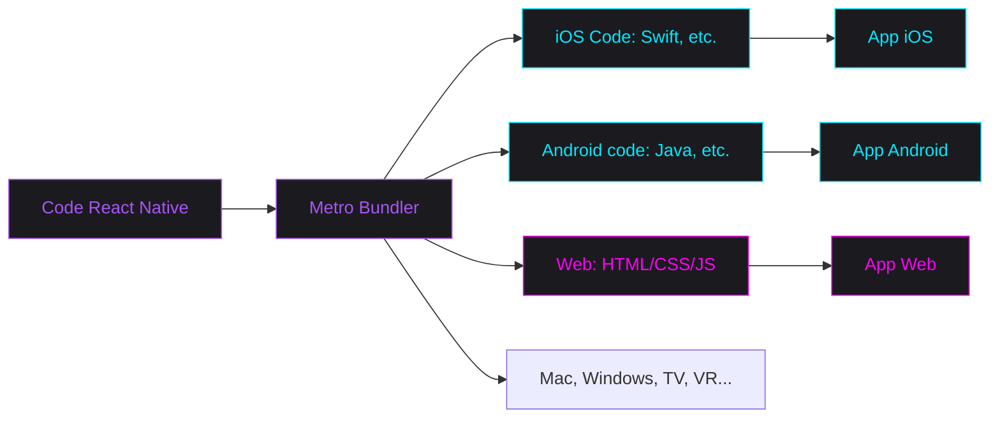

---
# You can also start simply with 'default'
theme: apple-basic # bricks
# random image from a curated Unsplash collection by Anthony
# like them? see https://unsplash.com/collections/94734566/slidev
background: https://source.unsplash.com/collection/94734566/1920x1080
# some information about your slides (markdown enabled)
title: Universal Beat & Play
info: |
  ## Universal Beat & Play 🕹️📲
  Développe des jeux musicaux multi-plateformes avec *React Native*
# apply unocss classes to the current slide
class: text-center
layout: center
# https://sli.dev/features/drawing
drawings:
  persist: false
# slide transition: https://sli.dev/guide/animations.html#slide-transitions
transition: slide-up
# enable MDC Syntax: https://sli.dev/features/mdc
mdc: true
# open graph
# seoMeta:
#  ogImage: https://cover.sli.dev
highlighter: shiki
lineNumbers: false
---

<style>
.main-title {
  position: absolute;
  top: 50%;
  left: 50%;
  transform: translate(-50%, -50%);
  width: 100%;
  padding: 2rem;
}

.main-title h1 {
  background: linear-gradient(to right, #00E8FF, #FF00F7);
  -webkit-background-clip: text;
  -webkit-text-fill-color: transparent;
  font-size: 4rem !important;
  line-height: 1.2 !important;
  margin-bottom: 1.5rem !important;
  padding: 0.5rem 0;
}

.main-title h2 {
  font-size: 2rem !important;
  line-height: 1.4 !important;
  opacity: 0.75;
  padding: 0.5rem 0;
}

.emoji {
  -webkit-background-clip: initial !important;
  -webkit-text-fill-color: initial !important;
  display: inline-block;
}

.bold-gradient {
  background: linear-gradient(to right, #00E8FF, #FF00F7);
  -webkit-background-clip: text;
  -webkit-text-fill-color: transparent;
  font-weight: bold;
}

.bold-blue {
  color: #00E8FF;
}

.slide-title, h1 {
  color: #00E8FF;
  font-size: 2.5rem !important;
  margin-bottom: 2rem !important;
}

.mermaid-diagram {
  border: 2px solid;
  border-image: linear-gradient(to right, #00E8FF, #FF00F7) 1;
  border-radius: 8px;
  padding: 1rem;
}

.code-block {
  border: 2px solid;
  border-image: linear-gradient(to right, #00E8FF, #FF00F7) 1;
  border-radius: 8px;
}

/* Styles pour le diagramme de Venn */
.border-gradient {
  border-image: linear-gradient(45deg, #00E8FF, #FF00F7) 1;
}

.border-\[\#00E8FF\] {
  box-shadow: 0 0 15px rgba(0, 232, 255, 0.2);
}

.border-\[\#FF00F7\] {
  box-shadow: 0 0 15px rgba(255, 0, 247, 0.2);
}

.bg-\[\#00E8FF10\] {
  background: rgba(0, 232, 255, 0.05);
}

.bg-\[\#FF00F710\] {
  background: rgba(255, 0, 247, 0.05);
}

/* Style pour les listes du diagramme de Venn */
.venn-list {
  list-style: none;
  padding: 0;
  margin: 0;
}

.venn-list li {
  display: flex;
  gap: 0.5rem;
}

.venn-list.text-right li {
  justify-content: flex-end;
}

/* Styles pour les points négatifs */
.negative-point {
  opacity: 0.6;
  font-style: italic;
  position: relative;
  padding-left: 1.5em;
}

.negative-point::before {
  content: "🚫";
  position: absolute;
  left: 0;
}
</style>

<div class="main-title">
  <h1>Universal Beat & Play <span class="emoji">🕹️📲</span></h1>
  <h2>Développe des jeux musicaux <br/>multi-plateformes avec <span class="bold-gradient">React Native</span></h2>
</div>

<div class="abs-bl ml-4 mb-4 flex items-center gap-4">
  
  <div class="flex flex-col">
    <div class="text-xl font-bold">Kim Chouard</div>
    <div class="text-sm opacity-75">
      CTO @ <a href="https://odiseimusic.com" target="_blank" class="text-blue-500 hover:underline">Odisei Music</a>
    </div>
  </div>
</div>

<div class="abs-br mr-4 mb-4 flex items-center gap-4">
  <div class="flex flex-col items-end">
    <div class="text-xl">23 Avril 2025</div>
    <div class="text-sm opacity-75">@Deezer Bordeaux</div>
  </div>
  
</div>

---
layout: center
class: text-center
transition: slide-up
---

# Levez la main si...

<div class="grid grid-cols-3 gap-12 mt-12">
  <div v-click class="flex flex-col items-center">
    <div class="text-2xl font-bold mb-4">Mobile Dev?</div>
    <div class="flex gap-4">
      
      
    </div>
  </div>
  <div v-click class="flex flex-col items-center">
    <div class="text-2xl font-bold mb-4">Web Dev?</div>
    
  </div>
  <div v-click class="flex flex-col items-center">
    <div class="text-2xl font-bold mb-4">React?</div>
    
  </div>
</div>

---
layout: center
class: text-center
transition: slide-left
---

# Levez la main si...

<div class="flex flex-row items-start gap-8">
  <div v-click class="flex flex-col items-center">
    <div class="text-2xl font-bold mb-4">Ça vous arrive d'avoir la <strong className="bold-blue">FLEMME</strong>? 😅</div>
    
  </div>
  <div v-click class="flex flex-col items-center">
    <div class="text-2xl font-bold mb-4">La solution?</div>
    
  </div>
</div>

---
layout: default
class: text-center
transition: slide-left
---

# Write once, run everywhere

<div class="absolute top-1/2 left-1/2 -translate-x-1/2 -translate-y-1/2 w-[1000px]">
  <div class="relative h-[500px]">
    <div v-click class="absolute -left-[150px] -top-[150px] w-[850px] h-[850px] rounded-full border-2 border-[#00E8FF] bg-[#00E8FF10] flex items-center">
      <div class="text-left pl-48 ml-[0px] -mt-[50px]">
        <div class="font-bold text-xl mb-4 text-[#00E8FF]">Mobile Dev</div>
        <ul class="venn-list">
          <li class="mb-2">📱 "Native Feel"</li>
          <li class="mb-2">✨ Accès complet: <br />capteurs, caméra, GPS...</li>
          <li class="mb-2">🚀 Performances</li>
          <li class="mb-2 opacity-50">🚫 1 équipe / platforme</li>
          <li class="mb-2 opacity-50">🚫 MAJ App Store longues</li>
        </ul>
      </div>
    </div>
    <div v-click class="absolute -right-[150px] -top-[150px] w-[850px] h-[850px] rounded-full border-2 border-[#FF00F7] bg-[#FF00F710] flex items-center justify-end">
      <div class="text-right pr-48 -mt-[50px]">
        <div class="font-bold text-xl mb-4 text-[#FF00F7]">Web Dev</div>
        <ul class="venn-list text-right">
          <li class="mb-2">⚡️ Dev Rapide</li>
          <li class="mb-2">🔄 Releases faciles</li>
          <li class="mb-2">📦 Gros écosystème</li>
          <li class="mb-2 opacity-50">🚫 Seulement sur navigateur</li>
          <li class="mb-2 opacity-50">🚫 Performance et<br />features limitées</li>
        </ul>
      </div>
    </div>
    <div v-click class="absolute left-1/2 top-1/2 -translate-x-1/2 -translate-y-1/2 w-[300px] z-10">
      <div class="text-center">
        <div class="font-bold text-2xl mb-6 bold-gradient">React Native</div>
        <ul class="venn-list text-left">
          <li class="mb-3">🔥 One Code</li>
          <li class="mb-3">🎯 Compiled Natively</li>
          <li class="mb-3">🚀 60 FPS</li>
          <li class="mb-3">🌈 Native Primitives</li>
          <li class="mb-3">🔄 Releases faciles</li>
        </ul>
      </div>
    </div>
  </div>
</div>

---
layout: default
transition: slide-left
---

# Comment ça marche?



<div class="-mt-26">
  <div v-click class="text-xl font-bold">Le meilleur des 2, 3... X mondes!</div>
  <ul class="list-disc pl-4 mt-4">
    <li v-click>Performance native</li>
    <li v-click>Développement rapide</li>
    <li v-click>Code partageable</li>
  </ul>
</div>

---
layout: default
transition: slide-left
---

# De React... à Native

<div class="grid grid-cols-2 gap-8 w-full">

<div class="flex-1 overflow-hidden">

````md magic-move {lines: true}
```tsx {all|2-3|6-16|all}
// WEB: Homepage.tsx component (<Homepage />)
import React from 'react';

const Homepage = () => {
  return (
    <div className="w-[400px] bg-[#1B1B1F] rounded-lg shadow-xl overflow-hidden p-8 flex flex-col items-center justify-center">
      <h1 className="text-2xl font-bold mb-2 text-white text-center">
        Welcome to<br />
        Odisei Play!
      </h1>
      <p className="text-gray-400">
        Let's make some music! 🎵
      </p>
      <a className="relative px-8 py-2 mt-6 text-xl font-bold rounded-xl bg-gradient-to-r from-[#FF00F7] via-[#FF00F7] to-[#d800d2] transition-all duration-200 -translate-y-0.5 shadow-[0_4px_0_rgb(153,0,140)] hover:-translate-y-1 hover:shadow-[0_6px_0_rgb(153,0,140)] active:translate-y-0.5 active:shadow-[0_0px_0_rgb(153,0,140)] before:absolute before:inset-0 before:bg-white before:opacity-20 before:rounded-xl before:transition-all hover:before:opacity-30 active:before:opacity-40">
        Enter
      </a>
    </div>
  );
};

export default Homepage;
```

```tsx {all|3-4|8-19|all}
// MOBILE: Homepage.tsx React-Native component (<Homepage />)
import React from 'react';
import { View, Text } from 'react-native';
import { Link } from 'expo-router';

const Homepage = () => {
  return (
    <View className="w-[400px] bg-[#1B1B1F] rounded-lg shadow-xl overflow-hidden p-8 flex flex-col items-center justify-center">
      <Text className="text-2xl font-bold mb-2 text-white text-center">
        Welcome to{'
'}
        Odisei Play!
      </Text>
      <Text className="text-gray-400">
        Let's make some music! 🎵
      </Text>
      <Link className="relative px-8 py-2 mt-6 text-xl font-bold rounded-xl bg-gradient-to-r from-[#FF00F7] via-[#FF00F7] to-[#d800d2] -translate-y-0.5 shadow-[0_4px_0_rgb(153,0,140)]" style={({ pressed }) => pressed ? 'translate-y-0.5 shadow-[0_0px_0_rgb(153,0,140)]' : '-translate-y-1 shadow-[0_6px_0_rgb(153,0,140)]'}>
        <Text className="text-white font-bold">Enter</Text>
      </Link>
    </View>
  );
};

export default Homepage;
```
````

</div>

<div class="flex">
  <!-- Simulateur avec bordure gradient -->
  <div class="
    relative p-8 rounded-[2rem]
    before:absolute before:inset-0
    before:p-[2px] before:rounded-[2rem]
    before:bg-gradient-to-r before:from-[#00E8FF] before:to-[#FF00F7]
    before:content-['']
    after:absolute after:inset-[1px]
    after:rounded-[calc(2rem-1px)]
    after:bg-[#1B1B1F]
    after:content-['']
  ">
    <div class="relative z-10 w-[400px] bg-[#1B1B1F] rounded-lg overflow-hidden p-8 flex flex-col items-center justify-center">
      <h1 class="text-2xl font-bold mb-2 text-white text-center">
        Welcome to<br />Odisei Play!
      </h1>
      <p class="text-gray-400">
        Let's make some music! 🎵
      </p>
      <button class="relative px-8 py-2 mt-6 text-xl font-bold rounded-xl bg-gradient-to-r from-[#FF00F7] via-[#FF00F7] to-[#d800d2] transition-all duration-200 -translate-y-0.5 shadow-[0_4px_0_rgb(153,0,140)] hover:-translate-y-1 hover:shadow-[0_6px_0_rgb(153,0,140)] active:translate-y-0.5 active:shadow-[0_0px_0_rgb(153,0,140)] before:absolute before:inset-0 before:bg-white before:opacity-20 before:rounded-xl before:transition-all hover:before:opacity-30 active:before:opacity-40">
        Enter
      </button>
    </div>
  </div>
</div>
</div>

---
layout: default
transition: slide-left
---

# Construire un jeux avec React Native

<div class="grid grid-cols-2 gap-8">
  <div v-click class="relative flex-1 h-[500px] h-full">
    <!-- Desktop Demo -->
    <div class="absolute inset-0 flex items-center justify-center h-full">
      <div class="relative w-[600px]">
        
        <div class="absolute top-[13.5%] left-[10.4%] right-[9.8%] bottom-[11%] overflow-hidden">
          <video autoplay loop="false" muted playsinline class="w-full h-full object-cover">
            <source src="/images/op-demo-desktop.mp4" type="video/mp4">
            
          </video>
        </div>
      </div>
    </div>
    <!-- Mobile Demo -->
    <div class="absolute top-[51%] -right-[5%] w-[250px] z-10">
      
      <div class="absolute top-[4%] left-[2%] right-[2%] bottom-[4%] overflow-hidden rounded-[15px] z-0">
        <video autoplay loop="false" muted playsinline class="w-full h-full object-cover">
          <source src="/images/op-demo-mobile.mp4" type="video/mp4">
          
        </video>
      </div>
    </div>
  </div>
  <div class="flex flex-col relative z-20">
    <div v-click class="text-xl font-bold mb-4">L'Ecosystem React Native</div>
    <ul class="space-y-3">
      <li v-click class="flex items-center gap-2">
        <span class="text-[#00E8FF]">▸</span>
        <a target="_blank" href="https://docs.swmansion.com/react-native-reanimated/" class="hover:text-[#00E8FF]">Reanimated</a>: Animations on UI thread
      </li>
      <li v-click class="flex items-center gap-2">
        <span class="text-[#00E8FF]">▸</span>
        <a target="_blank" href="https://www.nativewind.dev/v4/overview" class="hover:text-[#00E8FF]">NativeWind</a>: Universal Tailwind CSS
      </li>
      <li v-click class="flex items-center gap-2">
        <span class="text-[#00E8FF]">▸</span>
        <a target="_blank" href="https://docs.expo.dev/router/introduction/" class="hover:text-[#00E8FF]">Expo Router</a>: File-based Navigation + SSR
      </li>
      <li v-click class="flex items-center gap-2">
        <span class="text-[#00E8FF]">▸</span>
        <a target="_blank" href="https://shopify.github.io/react-native-skia/" class="hover:text-[#00E8FF]">React Native Skia</a>: High-Performance Graphics
      </li>
      <li v-click class="flex items-center gap-2">
        <span class="text-[#00E8FF]">▸</span>
        <a target="_blank" href="https://docs.expo.dev/eas/" class="hover:text-[#00E8FF]">EAS</a>: Build & Deploy Made Easy
      </li>
      <li v-click class="flex items-center gap-2">
        <span class="text-[#00E8FF]">▸</span>
        <a target="_blank" href="https://nitro.build/" class="hover:text-[#00E8FF]">Nitro Modules</a>: Native/C++ Code Integration
      </li>
      <li v-click class="flex items-center gap-2">
        <span class="text-[#00E8FF]">▸</span>
        <a target="_blank" href="https://github.com/wcandillon/react-native-webgpu" class="hover:text-[#00E8FF]">rn-web-gpu</a>: Universal 3D with WebGPU
      </li>
      <li v-click class="flex items-center gap-2">
        <span class="text-[#FF00F7]">▸</span>
        <span class="font-bold">Audio</span>: Let's talk about audio...
      </li>
    </ul>
  </div>
</div>

---
layout: center
class: text-center
transition: slide-up
---

# Plus de détails ici 👇

<div class="flex flex-col items-center max-w-lg mx-auto">
  <div class="relative">
    <!-- Thumbnail YouTube -->
    <a href="https://www.youtube.com/watch?v=PGvhniTxpu4" target="_blank" class="group">
      
      <div class="mt-2 flex items-center justify-center gap-2 text-sm opacity-75 group-hover:opacity-100 group-hover:text-red">
        <svg class="w-5 h-5" viewBox="0 0 24 24" fill="currentColor">
          <path d="M19.615 3.184c-3.604-.246-11.631-.245-15.23 0-3.897.266-4.356 2.62-4.385 8.816.029 6.185.484 8.549 4.385 8.816 3.6.245 11.626.246 15.23 0 3.897-.266 4.356-2.62 4.385-8.816-.029-6.185-.484-8.549-4.385-8.816zm-10.615 12.816v-8l8 3.993-8 4.007z"/>
        </svg>
        Voir sur YouTube
      </div>
    </a>
    <!-- Flèche et teaser -->
    <div v-click class="relative mt-8">
      <!-- Teaser -->
      <div class="p-4 bg-[#1B1B1F] rounded-xl relative overflow-none">
        <!-- Flèche courbe -->
        <svg class="absolute -top-22 -left-4 w-24 h-24 text-gray-700 opacity-25 rotate-270" viewBox="0 0 24 24" fill="none" stroke="currentColor">
          <path d="M4 12h10M4 12l4-4m-4 4l4 4" stroke-width="2" stroke-linecap="round" stroke-linejoin="round"/>
        </svg>
        <div class="text-sm text-left opacity-75">
          <strong>Kim in 2024:</strong> "React Native is 💩 for audio!"<br/>
          <strong>Kim in 2025:</strong> <a href="https://appjs.co/speakers/kim-chouard" target="_blank" class="text-red hover:underline">React Native + 🎵 = ❤️</a>
        </div>
      </div>
    </div>
</div>
</div>

---
layout: default
transition: slide-left
---

# Un exemple simple 🐐

<div class="grid grid-cols-2 gap-8">
  <div v-click class="flex flex-col items-center h-[80%]">
    <audio ref="goatSound" src="/chevre.mp3" preload="auto"></audio>
    <!-- Chrome-style browser bar -->
    <div class="w-[400px] bg-[#1B1B1F] rounded-t-xl overflow-hidden border-b border-gray-700 pb-2">
      <div class="flex items-center px-4 py-2 gap-2">
        <!-- Traffic lights -->
        <div class="flex gap-1.5">
          <div class="w-3 h-3 rounded-full bg-[#FF5F57]"></div>
          <div class="w-3 h-3 rounded-full bg-[#FFBD2E]"></div>
          <div class="w-3 h-3 rounded-full bg-[#28C840]"></div>
        </div>
        <!-- URL bar -->
        <div class="flex-1 bg-[#2B2B2F] rounded-md px-3 py-1 text-sm text-gray-400 flex items-center gap-2">
          <div class="w-4 h-4 text-gray-500">🔒</div>
          jesuisunechev.re
        </div>
      </div>
    </div>
    <div
      class="relative w-[400px] h-[400px] overflow-hidden cursor-pointer"
      @click="$refs.goatSound?.play()"
    >
      
      <div class="absolute inset-0 bg-black bg-opacity-30" />
    </div>
  </div>

  <div v-click class="flex flex-col">
    <div class="text-left">
```tsx
// jesuisunechev.re, universellement!! 🐐💨
import { useAudioPlayer } from 'expo-audio';
import { Image, Pressable } from 'react-native';

export default function GoatButton() {
  const player = useAudioPlayer({
    uri: require('./assets/chevre.mp3'),
    volume: 1.0,
  });

  return (
    <Pressable onPress={() => {
      player.play()
    }}>
      <Image
        source={require('./assets/chevre.jpg')}
        style={{ width: 400, height: 400 }}
      />
    </Pressable>
  );
}
```
    </div>
  </div>
</div>

---
layout: default
transition: slide-left
---

# L'Audio avec React Native

<div class="grid grid-cols-2 gap-8">
  <div v-click class="flex flex-col">
    <h3 class="text-xl font-bold mb-4 text-[#00E8FF]">Cas d'usage simples</h3>
    <a class="display-block p-4 bg-[#1B1B1F] rounded-xl mb-4" href="https://docs.expo.dev/versions/latest/sdk/audio/" target="_blank">
      <div class="font-bold mb-2 text-[#00E8FF]">expo-audio</div>
      <ul class="space-y-2">
        <li>✨ Jouer des sons (effets, musique)</li>
        <li>🎙️ Enregistrer des sons</li>
        <li>🔊 Contrôle basique (volume, pitch)</li>
        <li>📱 Cross-platform facile</li>
      </ul>
    </a>
    <div class="text-sm opacity-75 italic">
      Parfait pour les apps avec des besoins audio basiques
    </div>
  </div>

  <div v-click class="flex flex-col">
    <h3 class="text-xl font-bold mb-4 text-[#FF00F7]">Cas d'usage avancés</h3>
    <a class="display-block p-4 bg-[#1B1B1F] rounded-xl mb-4" href="https://docs.swmansion.com/react-native-audio-api/" target="_blank">
      <div class="font-bold mb-2 text-[#FF00F7]">react-native-audio-api</div>
      <ul class="space-y-2">
        <li>🎹 Synthétiseur audio</li>
        <li>🎛️ Effets audio (filtres, delay)</li>
        <li>⚡️ Latence ultra-basse</li>
        <li>🔄 Synchronisation précise</li>
      </ul>
    </a>
    <div class="text-sm opacity-75 italic">
      Pour les apps musicales professionnelles
    </div>
  </div>
</div>

---
layout: center
class: text-center
transition: slide-up
---

<h1 className="bold-gradient">Merci!</h1>

<div class="mt-8">
  <div class="text-xl font-bold">Questions?</div>
  <div class="mt-4">
    <a href="mailto:kim@odiseimusic.com" target="_blank" class="text-blue-500 hover:underline">kim@odiseimusic.com</a>
  </div>
  <div class="text-xl mt-8 font-bold">Envie d'apprendre le Sax? 🎷</div>
  <div class="mt-4">
    <a href="https://play.odiseimusic.com" target="_blank" class="text-blue-500 hover:underline">play.odiseimusic.com</a>
  </div>
</div> 