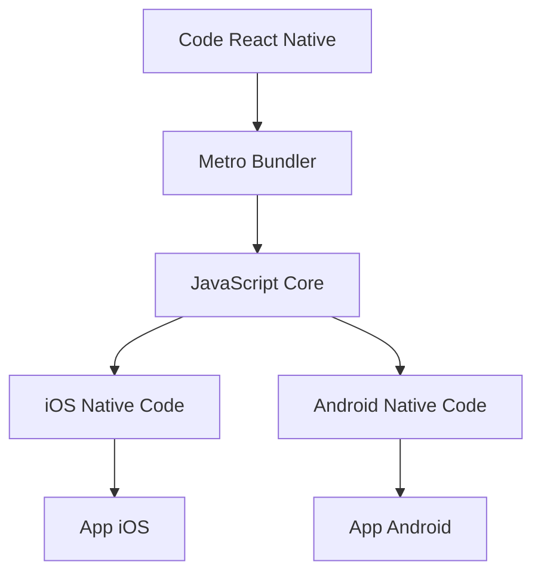

---
# You can also start simply with 'default'
theme: apple-basic # bricks
# random image from a curated Unsplash collection by Anthony
# like them? see https://unsplash.com/collections/94734566/slidev
background: https://source.unsplash.com/collection/94734566/1920x1080
# some information about your slides (markdown enabled)
title: Universal Beat & Play
info: |
  ## Universal Beat & Play 🕹️📲
  Développe des jeux musicaux multi-plateformes avec *React Native*
# apply unocss classes to the current slide
class: text-center
# https://sli.dev/features/drawing
drawings:
  persist: false
# slide transition: https://sli.dev/guide/animations.html#slide-transitions
transition: slide-up
# enable MDC Syntax: https://sli.dev/features/mdc
mdc: true
# open graph
# seoMeta:
#  ogImage: https://cover.sli.dev
highlighter: shiki
lineNumbers: false
---

<style>
.main-title {
  position: absolute;
  top: 50%;
  left: 50%;
  transform: translate(-50%, -50%);
  width: 100%;
  padding: 2rem;
}

.main-title h1 {
  background: linear-gradient(to right, #00E8FF, #FF00F7);
  -webkit-background-clip: text;
  -webkit-text-fill-color: transparent;
  font-size: 4rem !important;
  line-height: 1.2 !important;
  margin-bottom: 1.5rem !important;
  padding: 0.5rem 0;
}

.main-title h2 {
  font-size: 2rem !important;
  line-height: 1.4 !important;
  opacity: 0.75;
  padding: 0.5rem 0;
}

.emoji {
  -webkit-background-clip: initial !important;
  -webkit-text-fill-color: initial !important;
  display: inline-block;
}

.bold-gradient {
  background: linear-gradient(to right, #00E8FF, #FF00F7);
  -webkit-background-clip: text;
  -webkit-text-fill-color: transparent;
  font-weight: bold;
}

.slide-title {
  color: #00E8FF;
  font-size: 2.5rem !important;
  margin-bottom: 2rem !important;
}

.mermaid-diagram {
  border: 2px solid;
  border-image: linear-gradient(to right, #00E8FF, #FF00F7) 1;
  border-radius: 8px;
  padding: 1rem;
}

.code-block {
  border: 2px solid;
  border-image: linear-gradient(to right, #00E8FF, #FF00F7) 1;
  border-radius: 8px;
}
</style>

<div class="main-title">
  <h1>Universal Beat & Play <span class="emoji">🕹️📲</span></h1>
  <h2>Développe des jeux musicaux <br/>multi-plateformes avec <span class="bold-gradient">React Native</span></h2>
</div>

<div class="abs-bl ml-4 mb-4 flex items-center gap-4">
  
  <div class="flex flex-col">
    <div class="text-xl font-bold">Kim Chouard</div>
    <div class="text-sm opacity-75">
      CTO @ <a href="https://odiseimusic.com" class="text-blue-500 hover:underline">Odisei Music</a>
    </div>
  </div>
</div>

<div class="abs-br mr-4 mb-4 flex items-center gap-4">
  <div class="flex flex-col items-end">
    <div class="text-xl">23 Avril 2025</div>
    <div class="text-sm opacity-75">@Deezer Bordeaux</div>
  </div>
  
</div>

---
layout: center
class: text-center
transition: slide-up
---

<h1 class="slide-title">Levez la main si...</h1>

<div class="grid grid-cols-3 gap-12 mt-12">
  <div v-click class="flex flex-col items-center">
    <div class="text-2xl font-bold mb-4">Mobile Dev?</div>
    <div class="flex gap-4">
      
      
    </div>
  </div>
  <div v-click class="flex flex-col items-center">
    <div class="text-2xl font-bold mb-4">Web Dev?</div>
    
  </div>
  <div v-click class="flex flex-col items-center">
    <div class="text-2xl font-bold mb-4">React?</div>
    
  </div>
</div>

---
layout: center
class: text-center
transition: slide-left
---

<h1 class="slide-title">Levez la main si...</h1>

<div class="flex flex-row items-start gap-8">
  <div v-click class="flex flex-col items-center">
    <div class="text-2xl font-bold mb-4">Vous êtes un peu flemmard? 😅</div>
    
  </div>
  <div v-click class="flex flex-col items-center">
    <div class="text-2xl font-bold mb-4">La solution?</div>
    
  </div>
</div>

---
layout: default
transition: slide-left
---

# React Native pour les Devs React

<div class="grid grid-cols-2 gap-8">
  <div>
    <h3 class="text-xl font-bold mb-4">C'est quoi?</h3>
    <ul class="list-disc pl-4">
      <li v-click>Framework pour applications mobiles natives</li>
      <li v-click>Écrit en JavaScript/TypeScript</li>
      <li v-click>Utilise les composants React</li>
      <li v-click>Compilé en code natif</li>
    </ul>
  </div>
  <div>
    <h3 class="text-xl font-bold mb-4">Avantages</h3>
    <ul class="list-disc pl-4">
      <li v-click>Write once, run everywhere</li>
      <li v-click>Performance native</li>
      <li v-click>Hot Reload</li>
      <li v-click>Écosystème React</li>
    </ul>
  </div>
</div>

---
layout: default
transition: slide-left
---

# Comment ça marche?



<div class="mt-8">
  <div v-click class="text-xl font-bold">Le meilleur des deux mondes</div>
  <ul class="list-disc pl-4 mt-4">
    <li v-click>Performance native</li>
    <li v-click>Développement rapide</li>
    <li v-click>Code partageable</li>
  </ul>
</div>

---
layout: two-cols
transition: slide-left
---

# De Web à Mobile

```tsx
// App.tsx
import React from 'react';
import { View, Text } from 'react-native';

const App = () => {
  return (
    <View className="flex-1 bg-white">
      <View className="p-4">
        <Text className="text-2xl font-bold">
          Welcome to Odisei Play!
        </Text>
      </View>
    </View>
  );
};

export default App;
```

::right::

<div class="flex flex-col items-center justify-center h-full">
  <div v-click class="text-xl font-bold mb-4">NativeWind</div>
  <div v-click class="text-lg">Tailwind pour React Native</div>
  <div v-click class="mt-8">
    <code class="bg-gray-100 p-2 rounded">npm install nativewind</code>
  </div>
</div>

---
layout: default
transition: slide-left
---

# Playing UI avec Skia

<div class="grid grid-cols-2 gap-8">
  <div>
    <h3 class="text-xl font-bold mb-4">React Native Skia</h3>
    <ul class="list-disc pl-4">
      <li v-click>Rendu 2D performant</li>
      <li v-click>60 FPS garantis</li>
      <li v-click>Animations fluides</li>
    </ul>
  </div>
  <div>
    <h3 class="text-xl font-bold mb-4">Reanimated</h3>
    <ul class="list-disc pl-4">
      <li v-click>Animations natives</li>
      <li v-click>Thread UI dédié</li>
      <li v-click>Gestures</li>
    </ul>
  </div>
</div>

---
layout: default
transition: slide-left
---

# Gestion Audio

<div class="grid grid-cols-2 gap-8">
  <div>
    <h3 class="text-xl font-bold mb-4">expo-audio</h3>
    <ul class="list-disc pl-4">
      <li v-click>Simple d'utilisation</li>
      <li v-click>Parfait pour les débutants</li>
      <li v-click>Bonne documentation</li>
    </ul>
  </div>
  <div>
    <h3 class="text-xl font-bold mb-4">react-native-audio-api</h3>
    <ul class="list-disc pl-4">
      <li v-click>Plus de contrôle</li>
      <li v-click>Meilleures performances</li>
      <li v-click>Avancé</li>
    </ul>
  </div>
</div>

---
layout: center
class: text-center
transition: slide-left
---

# Merci!

<div class="mt-8">
  <div class="text-xl font-bold">Questions?</div>
  <div class="mt-4">
    <a href="https://odiseimusic.com" class="text-blue-500 hover:underline">odiseimusic.com</a>
  </div>
</div>
